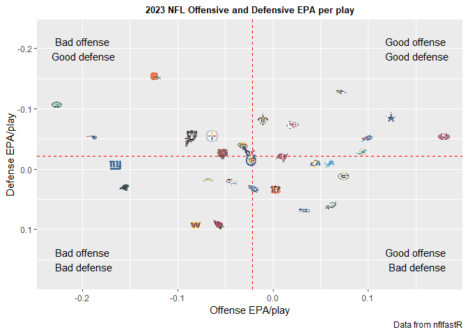
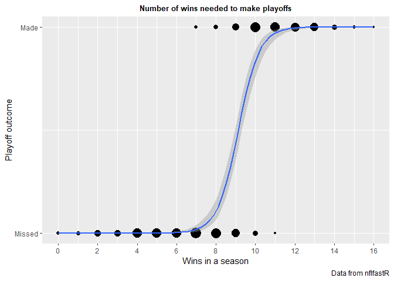

NFL stats
================
2024-01-17

- [NFL stats and using R’s nflfastR](#nfl-stats-and-using-rs-nflfastr)
- [Notation and general information](#notation-and-general-information)
  - [For play-by-play data:](#for-play-by-play-data)
  - [For game data](#for-game-data)
- [Data visualization: offensive and defensive EPA per play in a
  season](#data-visualization-offensive-and-defensive-epa-per-play-in-a-season)
  - [A note on EPA:](#a-note-on-epa)
  - [EPA Per play for each team in each
    season](#epa-per-play-for-each-team-in-each-season)
  - [Looping for years 1999-2022](#looping-for-years-1999-2022)
- [Logistic regression analysis of playoffs and
  wins](#logistic-regression-analysis-of-playoffs-and-wins)
  - [Some important notes about the
    data](#some-important-notes-about-the-data)
  - [Determining the record of each
    team](#determining-the-record-of-each-team)
  - [Playoff outcomes](#playoff-outcomes)
  - [Modeling playoffs ~ wins](#modeling-playoffs--wins)
- [Linear regression of wins ~ Total
  EPA](#linear-regression-of-wins--total-epa)
  - [Calculating EPA for every team in every
    year:](#calculating-epa-for-every-team-in-every-year)

## NFL stats and using R’s nflfastR

Documentation for nflfastR can be found here:
<https://www.nflfastr.com/> or with the R function

``` r
?nflfastR
```

<br> <br>

## Notation and general information

All teams are in standard 3 character team name abbreviation for teams
(eg: BAL for Baltimore Ravens)

<br> <br>

### For play-by-play data:

Play-by-play data found in `pbp` data frame

Posteam is the team with possesion of the ball at the start of the play.
Defteam is the defending team

<br> <br>

### For game data

Game data found in `games` data frame

The `games$result` column is the result of the game in numeric form
`home_score - away_score`

## Data visualization: offensive and defensive EPA per play in a season

We aim to look at the expected points added (EPA) for offense and
defense of each of the 32 teams for the 2022 season and plot the
results.

<br> <br>

### A note on EPA:

EPA is calculated on the backend of nflfastR with the
`Expected Points (EP)` model. Documentation for this model is found
here:
<https://opensourcefootball.com/posts/2020-09-28-nflfastr-ep-wp-and-cp-models/>

**The short version:** based on the context outside of the individual
play (year or era: import for rule changes, roof type) and the play
itself (game time, yard line, down, yards to go, etc) an individual play
will have some modeled number of points that the offense is “expected”
to score.

When looking at the offense: a positive EP means the offense is
outperforming the expected output. For example, an EP on offense of 0.25
means the offense outperformed the expected output by 0.25 points.
Positive and bigger is better.

When looking at the defense: a negative EP means the defense gave up
fewer points than expected. For example, an EP on defense of -0.25 means
the defense gave up less points than expected by 0.25 points. Negative
and bigger is better.

This value is known as the expected points (EP) of a given play. Across
an entire game or season (or any other period), the EP per play of all
plays can be averaged to an EPA (expected points average). This is the
number we are looking at.

<br> <br>

### EPA Per play for each team in each season

Full R code found in: `EpaPerPlay.R`

In order to easily visualize the EPA per play for each team in each
season, we first need to pull the relevant data from `nflfastR`:

``` r
year <- c(2023)
pbp <- nflfastR::load_pbp(year) %>%                         
  #filter for only regular season games
  dplyr::filter(season_type == "REG") %>%
  #filter out only rushes and passes (no sp teams)
  dplyr::filter(!is.na(posteam) & (rush == 1 | pass == 1))  
```

where `nflfastR::load_pbp` loads the entire play by play of all teams in
all games for the year in `year`

However, the EP data is calculated for every play for both teams. This
means that there is a mix of offense, defense, and special teams EP.

Since we’re only looking at offense and defense EPA, we can use
`dplyr::filter()` to filter non-special teams plays and plays where
there is no team in possession of the football.

An additional note: we’re only looking at `season_type = "REG"` games
which are regular season games.

<br> <br>

#### Splitting EP into offensive and defensive EPA

We need to split up the EP into offensive and defensive EP. In order to
do this, we create two new data frames `offense` and `defense` as
follows:

``` r
#Define offensive EPA by the mean of the EPA of the team on offense
offense <- pbp %>%                                          
  dplyr::group_by(team = posteam) %>%
  #strip NA values, take mean of EPA for offensive plays
  dplyr::summarise(off_epa = mean(epa, na.rm = TRUE))       

defense <- pbp %>%
  dplyr::group_by(team = defteam) %>%
  #strip NA values, take mean of EPA for defensive plays
  dplyr::summarise(def_epa = mean(epa, na.rm = TRUE))  
```

`dplyr::group_by()` allows us to pick only the team who either has the
ball at the start of the play (offense) or the team defending at the
start of the play (defense).

`dplyr::summarise()` allows to take the mean of all EP for those groups.

We now have two data frames for each year:

`offense` which has `$team`, `$off_epa`, and `$season`

`defense` which has `$team`, `$def_epa`, and `$season`

We can see the output for the year 2023 here. For example, the defensive
EPA across all of 2023 for ARI (Arizona Cardinals) is 0.091

``` r
defense
```

    ## # A tibble: 32 × 2
    ##    team  def_epa
    ##    <chr>   <dbl>
    ##  1 ARI    0.0909
    ##  2 ATL   -0.0460
    ##  3 BAL   -0.129 
    ##  4 BUF   -0.0508
    ##  5 CAR    0.0291
    ##  6 CHI   -0.0257
    ##  7 CIN    0.0331
    ##  8 CLE   -0.156 
    ##  9 DAL   -0.0871
    ## 10 DEN    0.0197
    ## # ℹ 22 more rows

<br> <br>

#### Plotting EPA for a single year for all teams

Using `ggplot`, the information we scraped from `nflfastR::pbp`, and
using the logos from `nflfastR::geom_nfl_logos` we can create a plot
with the offensive EPA on the x-axis and the defensive EPA on the y-axis
for every team in the year 2023.

``` r
##Creating the plot
plotEPA <- offense %>%
  #inner_join() strips away any x that doesn't have a matching y
  dplyr::inner_join(defense, by = "team") %>%  
  #graph offense EPA on x, defense EPA on y
  ggplot2::ggplot(aes(x = off_epa, y = def_epa)) +
    #add horizontal/vertical lines for mean values of off and def EPA
    nflplotR::geom_mean_lines(aes(y0 = off_epa, x0 = def_epa)) +
    #add team logos for data points
    nflplotR::geom_nfl_logos(aes(team_abbr = team),
                             width = 0.03, alpha = 0.7) +       
    labs(x = "Offense EPA/play", 
         y = "Defense EPA/play", 
         title = paste(year, "NFL Offensive and Defensive EPA per play"), caption = "Data from nflfastR") +                      
  
    #Since a negative defensive EPA per play is better, reverse the y-axis orientation so top right is best of both
    scale_y_reverse() +                                          

    theme_gray() +                                              
    theme(plot.title = element_text(size = 10,
                                    hjust = 0.5,
                                    face = "bold")              
          ) +
    
    annotate("text", 
             x = 0.15, y = -0.2,  vjust = 0.5, hjust = 0.5,
             label = "Good offense\n Good defense"
            ) + 
    annotate("text", 
             x = -0.2, y = 0.15,  vjust = 0.5, hjust = 0.5,
             label = "Bad offense\n Bad defense"
    ) +
    annotate("text", 
             x = -0.2, y = -0.2,  vjust = 0.5, hjust = 0.5,
             label = "Bad offense\n Good defense"
    ) + 
    annotate("text", 
             x = 0.15, y = 0.15,  vjust = 0.5, hjust = 0.5,
             label = "Good offense\n Bad defense"
    )
```

This gives us the following plot:

<!-- -->

which we can save using `ggplot2::ggsave` to our `EpaPerPlay_plots`
folder.

<br> <br>

### Looping for years 1999-2022

We can very easily do this for multiple years using a `for` loop and
setting our above code as a function with input `year`

Simply copy pasting the code above…

``` r
#Creating the function generate_plot as
generate_EPAplot <- function(year) {
  #exact same code as above...
  pbp <- nflfastR::load_pbp(year) %>%                         
    dplyr::filter(season_type == "REG") %>%
    dplyr::filter(!is.na(posteam) & (rush == 1 | pass == 1))  
  
  offense <- pbp %>%                                          
    dplyr::group_by(team = posteam) %>%
    dplyr::summarise(off_epa = mean(epa, na.rm = TRUE))       
  
  defense <- pbp %>%
    dplyr::group_by(team = defteam) %>%
    dplyr::summarise(def_epa = mean(epa, na.rm = TRUE))       
  
  plotEPA <- offense %>%
    dplyr::inner_join(defense, by = "team") %>%  
    ggplot2::ggplot(aes(x = off_epa, y = def_epa)) +
    nflplotR::geom_mean_lines(aes(y0 = off_epa, x0 = def_epa)) +
    nflplotR::geom_nfl_logos(aes(team_abbr = team),
                             width = 0.03, alpha = 0.7) +       
    labs(x = "Offense EPA/play", 
         y = "Defense EPA/play", 
         title = paste(year, "NFL Offensive and Defensive EPA per play"), caption = "Data from nflfastR") +                      
    scale_y_reverse() +                                          
    theme_gray() +                                              
    theme(plot.title = element_text(size = 10,
                                    hjust = 0.5,
                                    face = "bold")              
    ) +
    annotate("text", 
             x = 0.1, y = -0.1,  vjust = 0.5, hjust = 0.5,
             label = "Good offense\n Good defense"
    ) + 
    annotate("text", 
             x = -0.1, y = 0.1,  vjust = 0.5, hjust = 0.5,
             label = "Bad offense\n Bad defense"
    ) +
    annotate("text", 
             x = -0.1, y = -0.1,  vjust = 0.5, hjust = 0.5,
             label = "Bad offense\n Good defense"
    ) + 
    annotate("text", 
             x = 0.1, y = 0.1,  vjust = 0.5, hjust = 0.5,
             label = "Good offense\n Bad defense"
    )
  
  ggplot2::ggsave(file.path("EpaPerPlay_plots", paste("EpaPerPlay_", year, ".png")), plot = plotEPA)
}
```

We note that we’ve added the `ggsave` command inside the function.

Next we simply create the `for` loop:

``` r
for (year in 1999:2022) 
{generate_EPAplot(year) 
  }
```

Our folder `EpaPerPlay_plots` now has all the plots for offensive and
defensive EPA for the years 1999 through 2023.

<br> <br>

## Logistic regression analysis of playoffs and wins

Our major question: **How many wins is the “break point” to make the
playoffs on average?**

We use the number of wins in a season as our independent variable on the
X axis and our binary made playoffs as a binary “yes”=1 / “no”=0 for the
dependent variable on the y axis.

Our general logistic regression model formula is:

$$ P(X) = \frac{1}{1 + e^{-(\beta_0 + \beta_1 X_1)}} $$

where X is the amount of wins in a season,

where P(X) is the probability that the team made the playoffs,

where $\beta_0$ represents the odds of making the playoffs with 0 wins
(this should be equal to 0),

where $\beta_1$ represents the coefficient for wins as a predictor.

<br> <br>

### Some important notes about the data

The last expansion team was in 2002. This also led to conference
realignment and changes to playoff format. Thus, our first year will be
2002.

From 1978-2020, every team played 16 games. From 2021 on, every team
played 17,

Thus, we choose our time range to be 2002-2020.

Our goal is to pull each game’s data, determine the winner and loser (or
in case of ties, both teams that tied) and independently determine which
teams made or missed the playoffs.

<br> <br>

### Determining the record of each team

Each team, at the end of the year, has a record in the format
`wins-losses-ties` as convention.

For example, a team that won 11 games, lost 4, and tied 1 would have a
record of `11-4-1`.

To determine the record of all teams for all years, we can pull the
schedule of all games played and the events of that game using
`nflreadr::load_schedules()`:

``` r
years <- c(2002:2020)
#the games df is a list of all the games played from 1999 to current day
games <- nflreadr::load_schedules() %>%
  #filter such that only the games from 2002 up to 2020 are left
  dplyr::filter(season %in% years)

#From the entire games df, we're only interested in wins/losses/ties, so we filter out the rest
#Note: result in games df is the home_team score - away_team score.
win_loss_tie_columns <- games %>%
  dplyr::select(season, game_type, away_team, away_score, home_team, home_score, result, overtime) %>%
  #use mutate() to determine who won or lost (or if the game tied, both teams) that specific game
  dplyr::mutate(
    #set the winner based on the result column, where result >0 when home team wins
    Winner = ifelse(result < 0, away_team, ifelse(result > 0, home_team, NA)),
    #similar setup for loser
    Loser = ifelse(result < 0, home_team, ifelse(result > 0, away_team, NA)),
    #For ties, since both teams are awarded ties, we need to have both teams appear here.
    Tie = ifelse(result == 0, paste(home_team, away_team, sep = ","), NA)
  )
```

Lots going on here, so let’s go bit-by-bit:

We create the data frame `games` with the data pulled from
`nflreadr::loadschedules()`. This gives us 5075 games (including playoff
games) from the years in `years`.

Each game has `$home_team`, `$home_score`, `$away_team`, `$away_score`
and `$season`.

We create a new data frame `win_loss_tie_columns` which selects those
columns and uses `dplyr::mutate()` to determine the winner and loser of
the game. In case of ties (when `home_score - away_score = 0`), we have
to write down both teams in the `Tie` column and we separate using the
`sep = ","` argument for easier lookup later.

We can test this for a single team to see if the code works the way we
expect. We choose ATL 2002 because it is the first entry:

``` r
#For testing our function, we'll use a single year and a single team
year <- c(2002)
team <- c("ATL")

#From the games filtered df win_loss_tie_columns, we're going to filter for only regular season games
#and also for games only where our team of interest appeared. grepl() is used here because the $Ties
#column has more than a single team (if not NA)
win_loss_totals_ATL2002 <- win_loss_tie_columns %>%
  dplyr::filter(game_type == "REG" & season == year & (Winner == team | Loser == team | grepl(team, Tie))) %>%
  #Summarize() will let us build our new df with the team name, season, and sum the wins, losses, and ties
  #Again, we need to use grepl() because of the Ties entries
  dplyr::summarize(
    team = team,
    season = year,
    wins = sum(grepl(team, Winner)),
    losses = sum(grepl(team, Loser)),
    ties = sum(grepl(team, Tie))
  )
```

The output looks like this:

    ## # A tibble: 1 × 5
    ##   team  season  wins losses  ties
    ##   <chr>  <dbl> <int>  <int> <int>
    ## 1 ATL     2002     9      6     1

Now that we know it works, we can create a function that does this for
every team for every year in our range.

One thing to note: some teams have moved since 2002 and thus changed
their 3 letter name (eg: the Chargers went from SD to LAC after moving
from San Diego to Los Angeles). We can filter them out by removing teams
that were 0-0-0 for a season.

We create our function:

``` r
#Note: some teams relocated (looking at you chargers) so there are more than 32 unique teams
list_of_teams <- unique(games$home_team)

calculate_totals <- function(team,year) {
  totals <- win_loss_tie_columns %>%
    #below is the exact same code that generated our single team win/loss/tie table
    dplyr::filter(game_type == "REG" & season == year & (Winner == team | Loser == team | grepl(team, Tie))) %>%
    dplyr::summarize(
      team = team,
      season = year,
      wins = sum(grepl(team, Winner)),
      losses = sum(grepl(team, Loser)),
      ties = sum(grepl(team, Tie))
    )
  return(totals)
}

#Create an empty data frame to populate
win_loss_totals_allteams_allyears <- data.frame()
#populate the data frame with our function, running it for every team and every year
for (team in list_of_teams) {
  for (year in years) {
    win_loss_totals_allteams_allyears <- bind_rows(win_loss_totals_allteams_allyears, calculate_totals(team,year))
  }
}

#we need to filter out instances of years/teams where they played zero total games
win_loss_totals_allteams_allyears <- win_loss_totals_allteams_allyears %>%
  dplyr::filter(
    !(wins == 0 & losses == 0 & ties == 0)
  )
```

We can do a sanity check to see if we dropped any games by dividing the
number of sets of 32 rows and comparing that to the amount of seasons
that have passed from 2002 to 2020:

``` r
#Note: years from X to Y have "Y-X+1" NFL seasons in them
cat("Number of seasons worth of games that 32 teams have played:", 
    #the number of rows equates to all the seasons of all the teams in the year range picked
    nrow(win_loss_totals_allteams_allyears) / 32, 
    "\n", 
    "Number of seasons actually played:", 
    #Simply the last year - first year in the range we looked at, keeping in mind the +1 season
    max(years) - min(years) + 1
)
```

    ## Number of seasons worth of games that 32 teams have played: 19 
    ##  Number of seasons actually played: 19

Since both those values are the same, we didn’t drop any games.

<br> <br>

### Playoff outcomes

Now let’s look at the playoff outcomes of all the teams. We can do this
by simply looking at which teams appeared in playoff games.

Since `nflfastR::load_schedules()` (and thus `games`) doesn’t look at
preseason games, this is simply every team that appeared in non-REG
games.

We only want to know the last game that each team played. This will let
us determine how far into the playoffs each team got (ie: did a team get
eliminated in the divisional round? did they win the Superbowl?)

We first look at all non-REG games, then determine the outcome of the
game (winner, loser, tie). Though `$Tie` isn’t really a possibility
since playoff games cannot end in ties, keeping the format will make
further data analysis easier.

Then, we create a new data frame `playoff_outcomes` that pulls all the
losers. This will track the last game that that team played (and thus is
the outcome of their playoff run).

Finally, we need to create a new data frame `list_of_SB_winners`
because, by definition, the winner of the Superbowl has never lost a
game that playoff run.

Merging all those will give us the `playoff_outcomes` final data frame.

``` r
playoff_games <- games %>%
  dplyr::select(season, game_type, away_team, away_score, home_team, home_score, result, overtime) %>%
  dplyr::filter(game_type != "REG") %>%
  dplyr::mutate(
    #set the winner based on the result column, where result >0 when home team wins
    Winner = ifelse(result < 0, away_team, ifelse(result > 0, home_team, NA)),
    #similar setup for loser
    Loser = ifelse(result < 0, home_team, ifelse(result > 0, away_team, NA)),
    #For ties, since both teams are awarded ties, we need to have both teams appear here.
    Tie = ifelse(result == 0, paste(home_team, away_team, sep = ","), NA)
  )

#Make a df which will be merged with the win_loss_totals df. Includes season, team, and takes the loser of the game.
#We're taking the loser because the winner plays an additional game.
playoff_outcomes <- playoff_games %>%
  select(
    season,
    game_type,
    Team = Loser
  ) 

#The above doesn't account for the winner of the last game since that team never lost a playoff game that year.
#In order to account for this, we can look specifically at only the winner of the game_type SB games.
list_of_SB_winners <- playoff_games %>%
  filter(game_type == "SB") %>%
  select(
    season,
    game_type,
    Team = Winner
  ) %>%
#We would also like to be able to differentiate them from the loser of the game, so we'll call them "CHMP" for champion
  mutate(
    game_type = "CHMP"
  )
#Merge the two above df to get a single df that has the list of all playoff game outcomes.
playoff_outcomes <- bind_rows(playoff_outcomes, list_of_SB_winners)
```

For our logistic regression model, we’ll need create a `$playoffs`
column with values of `0` or `1` which we can associate with missing or
making the playoffs.

The easiest way to do this is creating a `$playoffs` column and setting
that value to 0 for all teams, then overwriting those with a 1 for teams
which have a non-`NA` value for the `$game_type` which we have as the
last game type that the playoff teams played in (eg: `SB`, `DIV`, etc)

``` r
win_loss_totals_allteams_allyears$playoffs <- 0

#merge playoff_outcomes into win_loss_totals_allteams_allyears such that the $game_type column gets added to the respective teams by matching columns season AND team
win_loss_totals_allteams_allyears <- merge(win_loss_totals_allteams_allyears, playoff_outcomes, by.x = c("season", "team"), by.y = c("season", "Team"), all.x = TRUE)
#set the value for $playoffs to 1 if the value in $game_type is not NA so that we can have a binary made/missed playoffs value
win_loss_totals_allteams_allyears$playoffs <- ifelse(!is.na(win_loss_totals_allteams_allyears$game_type), 1, win_loss_totals_allteams_allyears$playoffs)
```

Looking at our output where we look only at the win, loss, tie,
playoffs, and game_type columns…

``` r
tibble(win_loss_totals_allteams_allyears)
```

    ## # A tibble: 608 × 7
    ##    season team   wins losses  ties playoffs game_type
    ##     <int> <chr> <int>  <int> <int>    <dbl> <chr>    
    ##  1   2002 ARI       5     11     0        0 <NA>     
    ##  2   2002 ATL       9      6     1        1 DIV      
    ##  3   2002 BAL       7      9     0        0 <NA>     
    ##  4   2002 BUF       8      8     0        0 <NA>     
    ##  5   2002 CAR       7      9     0        0 <NA>     
    ##  6   2002 CHI       4     12     0        0 <NA>     
    ##  7   2002 CIN       2     14     0        0 <NA>     
    ##  8   2002 CLE       9      7     0        1 WC       
    ##  9   2002 DAL       5     11     0        0 <NA>     
    ## 10   2002 DEN       9      7     0        0 <NA>     
    ## # ℹ 598 more rows

<br> <br>

### Modeling playoffs ~ wins

We can now do a logistic regression model to try to find out if
making/missing the playoffs (y value, binary 0 or 1) is related to the
number of wins in a season.

We can look at the model summary using `summary(model)` and a plot of
the data with `ggplot`:

``` r
#We expect a very high relationship between the two since this is how the playoff format is determined.
model <- glm(playoffs ~ wins, data = win_loss_totals_allteams_allyears, family = binomial)

#Isolate $wins from the df because that seems to be an easier way to handle the data when making the plot
win_counts <- as.data.frame(table(win_loss_totals_allteams_allyears$wins))
#Slight rename of the columns
colnames(win_counts) <- c("Wins", "Frequency")

#Plotting the logistic regression model
plot <- ggplot2::ggplot(
  data = win_loss_totals_allteams_allyears,
  mapping = aes(x = wins, y = playoffs)
) +
  geom_count() +
  geom_smooth(method = "glm", method.args = list(family = "binomial")) +
  labs(x = "Wins in a season",
       y = "Playoff outcome",
       title = "Number of wins needed to make playoffs",
       caption = "Data from nflfastR",
       size = "Frequency") +
  theme_gray() +
  theme(plot.title = element_text(size = 10,
                                  hjust = 0.5,
                                  face = "bold")
  ) +
  scale_x_continuous(breaks = seq(0, 16, by = 2)) +
  scale_y_continuous(labels = c("Missed", "Made"), breaks = c(0, 1)) +
  theme(legend.position = "none")
```

Our plot and summary:

``` r
#Print summary of model to look if the coefficients have statistical significance
summary(model)
```

    ## 
    ## Call:
    ## glm(formula = playoffs ~ wins, family = binomial, data = win_loss_totals_allteams_allyears)
    ## 
    ## Coefficients:
    ##             Estimate Std. Error z value Pr(>|z|)    
    ## (Intercept) -17.0847     1.6595  -10.29   <2e-16 ***
    ## wins          1.8713     0.1817   10.30   <2e-16 ***
    ## ---
    ## Signif. codes:  0 '***' 0.001 '**' 0.01 '*' 0.05 '.' 0.1 ' ' 1
    ## 
    ## (Dispersion parameter for binomial family taken to be 1)
    ## 
    ##     Null deviance: 806.48  on 607  degrees of freedom
    ## Residual deviance: 223.79  on 606  degrees of freedom
    ## AIC: 227.79
    ## 
    ## Number of Fisher Scoring iterations: 7

``` r
#visualizing the plot
plot
```

    ## `geom_smooth()` using formula = 'y ~ x'

<!-- -->

Getting a few additional pieces of information, such as the probability
of making the playoffs with x wins using our P(x) model with `plogis()`.

Note that since we only have a few values for wins and we didn’t split
up wins by year, every team with x wins will have the same probability
of making the playoffs.

``` r
#Evaluating the probability of making the playoffs with "x" wins using plogis()
#plogis() uses the logit function to associate odds of an outcome with the event
#Since we're looking at % chance, we need to multiply by 100
probabilities <- plogis(predict(model, type = "link")) *100
#Adding "percent change to make playoffs" column
win_loss_totals_allteams_allyears$probability_to_make_playoffs <- sprintf("%.2f",probabilities)
#We can summarize the plogis() results by looking at the unique/distinct values of wins and probabilities
Chance_to_make_playoffs_per_win <- win_loss_totals_allteams_allyears %>%
  distinct(wins, probability_to_make_playoffs)
```

We can sort by number of wins (ascending) using `order()`. Our
probabilities for each team are as follows:

    ## # A tibble: 17 × 2
    ##     wins probability_to_make_playoffs
    ##    <int> <chr>                       
    ##  1     0 0.00                        
    ##  2     1 0.00                        
    ##  3     2 0.00                        
    ##  4     3 0.00                        
    ##  5     4 0.01                        
    ##  6     5 0.04                        
    ##  7     6 0.29                        
    ##  8     7 1.82                        
    ##  9     8 10.77                       
    ## 10     9 43.96                       
    ## 11    10 83.60                       
    ## 12    11 97.07                       
    ## 13    12 99.54                       
    ## 14    13 99.93                       
    ## 15    14 99.99                       
    ## 16    15 100.00                      
    ## 17    16 100.00

At 9 wins in a season, a team has about a 44% chance to make the
playoffs. This jumps up to a whopping 84% at 10 wins! <br> <br>

## Linear regression of wins ~ Total EPA

<br> <br>

### Calculating EPA for every team in every year:

We can calculate the EPA for every team in every year (within our range)
by pulling the play-by-play data from `nflfastR::load_pbp()` and loop
over `years = 2002:2020`.

After grouping and summarizing with dplyr’s `group_by()` and
`summarize()`, we can merge that data into our `win_loss_totals` data
frame as follows:

``` r
#Loop over the following years
years <- c(2002:2020)

#Create an empty data frame to store the output of our loop
result_df <- data.frame()

# Loop over the years vector
for (year in years) {
  pbp <- nflfastR::load_pbp(year) %>%
    dplyr::filter(season_type == "REG" & !is.na(posteam) & (rush == 1 | pass == 1))
  
  
  # Define offensive EPA by the mean of the EPA of the team on offense
  offense <- pbp %>%
    dplyr::group_by(team = posteam) %>%
    dplyr::summarise(off_epa = mean(epa, na.rm = TRUE))
  
  
  defense <- pbp %>%
    dplyr::group_by(team = defteam) %>%
    dplyr::summarise(def_epa = mean(epa, na.rm = TRUE))
  
  # Add a column with the value from the year
  offense$season <- year
  defense$season <- year
  
  # Append the results to the main data frame
  result_df <- bind_rows(result_df, offense, defense)
}


#combine such that off_epa and def_epa appear in the same row for each team
result_df_combined <- result_df %>%
  dplyr::mutate_if(is.numeric, round, digits = 6)%>%
  dplyr::group_by(season, team) %>%
  dplyr::reframe(across(everything(), ~na.omit(.)))

merged_df <- merge(win_loss_totals_allteams_allyears, result_df_combined, by = c("season", "team"), all.x = TRUE)
# merged_df$total_epa <- rowSums(merged_df[, c("off_epa", "def_epa")], na.rm = TRUE)
merged_df$total_epa <- merged_df$off_epa - merged_df$def_epa


#Make and save the dataframe as a .csv for later use if needed in the data folder.
common_columns <- c("season", "team")
specific_columns <- c("off_epa", "def_epa", "total_epa")
merged_df_subset <- merged_df[, c(common_columns, specific_columns)]
win_loss_totals_allteams_allyears_merged <- merge(win_loss_totals_allteams_allyears, merged_df_subset, by = common_columns, all.x = TRUE)
```

Which gives us our final

``` r
tibble(win_loss_totals_allteams_allyears_merged)
```

    ## # A tibble: 608 × 11
    ##    season team   wins losses  ties playoffs game_type probability_to_make_play…¹
    ##     <int> <chr> <int>  <int> <int>    <dbl> <chr>     <chr>                     
    ##  1   2002 ARI       5     11     0        0 <NA>      0.04                      
    ##  2   2002 ATL       9      6     1        1 DIV       43.96                     
    ##  3   2002 BAL       7      9     0        0 <NA>      1.82                      
    ##  4   2002 BUF       8      8     0        0 <NA>      10.77                     
    ##  5   2002 CAR       7      9     0        0 <NA>      1.82                      
    ##  6   2002 CHI       4     12     0        0 <NA>      0.01                      
    ##  7   2002 CIN       2     14     0        0 <NA>      0.00                      
    ##  8   2002 CLE       9      7     0        1 WC        43.96                     
    ##  9   2002 DAL       5     11     0        0 <NA>      0.04                      
    ## 10   2002 DEN       9      7     0        0 <NA>      43.96                     
    ## # ℹ 598 more rows
    ## # ℹ abbreviated name: ¹​probability_to_make_playoffs
    ## # ℹ 3 more variables: off_epa <dbl>, def_epa <dbl>, total_epa <dbl>

which we save as a .csv file for later use with:

We pose the question: does having a higher total EPA generate more wins
over a single season?

Using `lm()` we can build a linear regression model that fits the
independent variable Total EPA to the dependent variable Wins.

``` r
lim_model <- lm(wins ~ total_epa, data = merged_df)

## Print the summary of the model
#For wins ~ total_epa however, we have a nice linear regression line
summary(lim_model)
```

    ## 
    ## Call:
    ## lm(formula = wins ~ total_epa, data = merged_df)
    ## 
    ## Residuals:
    ##     Min      1Q  Median      3Q     Max 
    ## -4.0884 -1.0052  0.0223  0.9710  4.0381 
    ## 
    ## Coefficients:
    ##             Estimate Std. Error t value Pr(>|t|)    
    ## (Intercept)  8.00677    0.06188  129.39   <2e-16 ***
    ## total_epa   24.22434    0.55458   43.68   <2e-16 ***
    ## ---
    ## Signif. codes:  0 '***' 0.001 '**' 0.01 '*' 0.05 '.' 0.1 ' ' 1
    ## 
    ## Residual standard error: 1.465 on 559 degrees of freedom
    ##   (47 observations deleted due to missingness)
    ## Multiple R-squared:  0.7734, Adjusted R-squared:  0.773 
    ## F-statistic:  1908 on 1 and 559 DF,  p-value: < 2.2e-16

``` r
plot <- ggplot2::ggplot(merged_df, aes(x = total_epa, y = wins)) +
  geom_point() +
  geom_smooth(method = "lm", se = FALSE, color = "blue") +
  labs(x = "Total EPA", 
       y = "Wins",
       title = "Number of wins by total EPA",
       caption = "Data from nflfastR") +
  theme_gray() +
  theme(plot.title = element_text(size = 10,
                                  hjust = 0.5,
                                  face = "bold")) +
  scale_y_continuous(breaks = seq(0, 16, by = 2))

plot
```

    ## `geom_smooth()` using formula = 'y ~ x'

    ## Warning: Removed 47 rows containing non-finite values (`stat_smooth()`).

    ## Warning: Removed 47 rows containing missing values (`geom_point()`).

<!-- -->

``` r
#We can extract even more data from our model summary, such as the deviance, residuals, AIC, etc
summary(lim_model)
```

    ## 
    ## Call:
    ## lm(formula = wins ~ total_epa, data = merged_df)
    ## 
    ## Residuals:
    ##     Min      1Q  Median      3Q     Max 
    ## -4.0884 -1.0052  0.0223  0.9710  4.0381 
    ## 
    ## Coefficients:
    ##             Estimate Std. Error t value Pr(>|t|)    
    ## (Intercept)  8.00677    0.06188  129.39   <2e-16 ***
    ## total_epa   24.22434    0.55458   43.68   <2e-16 ***
    ## ---
    ## Signif. codes:  0 '***' 0.001 '**' 0.01 '*' 0.05 '.' 0.1 ' ' 1
    ## 
    ## Residual standard error: 1.465 on 559 degrees of freedom
    ##   (47 observations deleted due to missingness)
    ## Multiple R-squared:  0.7734, Adjusted R-squared:  0.773 
    ## F-statistic:  1908 on 1 and 559 DF,  p-value: < 2.2e-16

Note that we can save the `summary()` of our model using:

We get a decently well fit curve with coefficient of determination
$R^2 = 0.773$ and a p-value $p < 10^{-15}$.

We can conclude that teams with a higher EPA generally win more games,
at a rate of 1 win every ~24.2 total EPA. Intuitively, we can gather
that for every ~24.2 points “extra” that a team scores, they get an
additional win.
